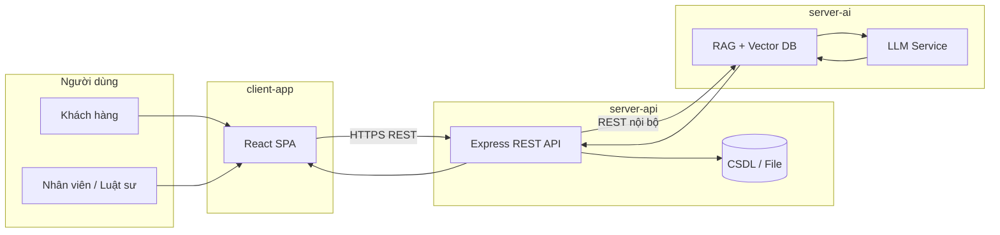

# Trang web Văn phòng Luật tích hợp AI Tư vấn

Dự án tiểu luận xây dựng hệ thống web cho văn phòng luật, gồm **ba thành phần độc lập** giao tiếp qua **REST API**. Mã nguồn được tổ chức dạng **monorepo** trong thư mục gốc `law-firm-project`.

## Cấu trúc monorepo

```
law-firm-project/
├── client-app/      # React — giao diện Khách hàng & Nhân viên
├── server-api/      # Node.js Express — quản trị, nghiệp vụ, điều hướng
├── server-ai/       # Python FastAPI — RAG, LLM, tư vấn AI
├── INTEGRATION.md   # Hướng dẫn chạy & nối 3 service
└── README.md        # Tài liệu này
```

**Chạy tích hợp đầy đủ:** xem [INTEGRATION.md](./INTEGRATION.md).

## Vai trò từng thành phần

| Thư mục | Công nghệ | Vai trò |
|---------|-----------|---------|
| **client-app** | React | SPA hiển thị trang công khai, cổng khách, dashboard nhân viên/luật sư; gọi API qua HTTP; không gọi trực tiếp `server-ai`. |
| **server-api** | Node.js + Express | API trung tâm: xác thực, hồ sơ vụ việc, lịch hẹn, nội dung CMS; **proxy/điều phối** yêu cầu AI sang `server-ai`; lưu lịch sử hội thoại và metadata. |
| **server-ai** | Python + FastAPI | Pipeline RAG (embedding, vector store, retrieval), gọi LLM, prompt an toàn; **chỉ** nhận request nội bộ từ `server-api`, không expose ra trình duyệt. |

## Kiến trúc & luồng dữ liệu (Data Flow)



### Luồng điển hình

1. **Khách / Nhân viên → client-app**  
   Người dùng thao tác trên React (form, chat, tra cứu). Frontend gửi `Authorization` (JWT/session) tới **một** base URL của `server-api`.

2. **client-app → server-api**  
   Mọi nghiệp vụ (đăng nhập, CRUD hồ sơ, đặt lịch, upload tài liệu) đi qua Express. API validate input, phân quyền, ghi log.

3. **server-api → server-ai** (khi cần tư vấn AI)  
   - `server-api` nhận câu hỏi / ngữ cảnh vụ việc (đã lọc PII nếu cần).  
   - Gọi REST tới `server-ai` (ví dụ: `/v1/consult`, `/v1/embed`).  
   - `server-ai` retrieval từ vector store → ghép prompt → LLM → trả câu trả lời + trích dẫn nguồn.  
   - `server-api` lưu transcript, gắn `case_id` / `user_id`, trả JSON cho frontend.

4. **Phản hồi → client-app**  
   UI render câu trả lời, gợi ý bước tiếp theo hoặc chuyển luật sư (human-in-the-loop).

### Nguyên tắc ranh giới

- **Frontend chỉ biết `server-api`** — tránh lộ khóa LLM và giảm bề mặt tấn công.  
- **`server-ai` không có session người dùng** — tin tưởng request đã được `server-api` xác thực (API key / mạng nội bộ).  
- **Dữ liệu nhạy cảm**: lưu bền vững tại `server-api`; vector store trên `server-ai` chỉ chứa chunk đã được phê duyệt index.

## Biến môi trường (gợi ý)

| Biến (client) | Mô tả |
|---------------|--------|
| `VITE_API_BASE_URL` | URL `server-api` (ví dụ `http://localhost:3000/api`) |

| Biến (server-api) | Mô tả |
|-------------------|--------|
| `PORT` | Cổng Express |
| `AI_SERVICE_URL` | URL `server-ai` (ví dụ `http://localhost:8000`) |
| `AI_SERVICE_API_KEY` | Khóa gọi nội bộ tới AI service |

| Biến (server-ai) | Mô tả |
|----------------|--------|
| `PORT` | Cổng FastAPI |
| `LLM_API_KEY` | Khóa nhà cung cấp LLM |
| `VECTOR_DB_URL` | Kết nối vector database |

## Chạy local (thứ tự gợi ý)

```bash
# Terminal 1 — AI service
cd server-ai && pip install -r requirements.txt && uvicorn app.main:app --reload

# Terminal 2 — API gateway
cd server-api && npm install && npm run dev

# Terminal 3 — Frontend
cd client-app && npm install && npm run dev
```

## Tài liệu chi tiết

- [client-app/README.md](./client-app/README.md) — cấu trúc React, routing, state.  
- [server-api/README.md](./server-api/README.md) — routes, middleware, tích hợp AI.  
- [server-ai/README.md](./server-ai/README.md) — RAG pipeline, endpoints FastAPI.

## Giấy phép & học thuật

Dự án phục vụ mục đích tiểu luận / nghiên cứu. Không thay thế tư vấn pháp lý chính thức; mọi kết quả AI cần được luật sư xem xét trước khi áp dụng.
