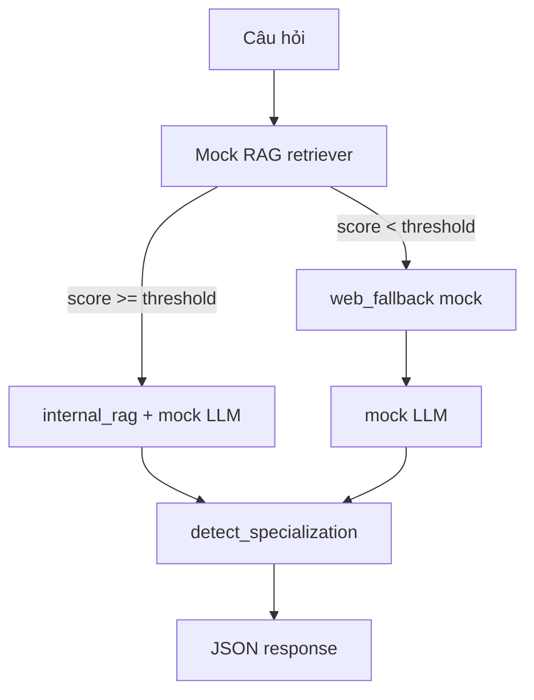

# server-ai — FastAPI (RAG tư vấn luật)

Microservice Python xử lý **Retrieval-Augmented Generation** và sinh câu trả lời bằng **Google Gemini** cho văn phòng luật.

## Cấu trúc

```
server-ai/
├── main.py                      # FastAPI app
├── app/
│   ├── api/v1/routes/           # predict-consultation
│   ├── core/                    # config, API key
│   ├── schemas/                 # Pydantic request/response
│   ├── services/
│   │   ├── document_loader.py   # Đọc txt/pdf cục bộ
│   │   ├── rag_retriever.py     # So khớp mock (thay LangChain)
│   │   ├── web_fallback.py      # Tìm kiếm web giả lập
│   │   ├── mock_llm.py          # Sinh câu trả lời
│   │   ├── specialization.py    # Nhãn chuyên môn
│   │   └── consultation_service.py
│   └── data/                    # Văn bản luật mẫu (.txt, .pdf)
├── requirements.txt
└── .env.example
```

## Endpoint chính

**POST** `/api/v1/predict-consultation`

Header: `X-API-Key: <API_KEY>`

Body:
```json
{ "message": "Tôi muốn ly hôn đơn phương...", "case_context": null }
```

Response:
```json
{
  "answer": "...",
  "source": "internal_rag",
  "detected_specialization": "Hôn nhân gia đình"
}
```

- `source`: `internal_rag` (độ tương đồng ≥ ngưỡng) hoặc `web_fallback`
- Ngưỡng mặc định: `RAG_SIMILARITY_THRESHOLD=0.35`

Alias: **POST** `/api/v1/consult` (tương thích `server-api`)

### Quản lý tài liệu luật (CRUD — API key)

| Method | Path | Mô tả |
|--------|------|--------|
| GET | `/api/v1/documents` | Danh sách tài liệu |
| GET | `/api/v1/documents/{doc_id}` | Chi tiết + nội dung |
| POST | `/api/v1/documents` | Thêm file `.txt` + `.meta.json` |
| PUT | `/api/v1/documents/{doc_id}` | Cập nhật title / chuyên môn / nội dung |
| DELETE | `/api/v1/documents/{doc_id}` | Xóa — tự `reload()` RAG |

Sau mỗi thay đổi, `MockRAGRetriever.reload()` nạp lại kho `app/data`.

## Luồng nghiệp vụ



## Chạy local

```bash
cd server-ai
python -m venv .venv
.venv\Scripts\activate   # Windows
pip install -r requirements.txt
copy .env.example .env
uvicorn main:app --reload --port 8000
```

Kiểm tra: `GET http://localhost:8000/health`

### Bật Google Gemini

1. Tạo API key trong [Google AI Studio](https://aistudio.google.com/app/apikey).
2. Thêm cấu hình vào `.env` (không commit API key):

```env
GEMINI_API_KEY=your-gemini-api-key
GEMINI_MODEL=gemini-3.6-flash
GEMINI_MAX_OUTPUT_TOKENS=1000
```

3. Khởi động lại `server-ai`, sau đó kiểm tra `/health`: `ai_provider` phải là `gemini`.
4. Gửi câu hỏi qua web hoặc `POST /api/v1/predict-consultation`; response phải có `ai_provider: "gemini"`.

## Gemini và chế độ fallback

- **Gemini:** khi có `GEMINI_API_KEY`, hệ thống dùng SDK chính thức `google-genai` và model cấu hình trong `GEMINI_MODEL`.
- **RAG:** nội dung trả lời được ràng buộc bởi văn bản tìm thấy trong `app/data`; prompt yêu cầu không tự bịa căn cứ pháp luật.
- **Fallback:** khi chưa có key hoặc Gemini tạm lỗi, hệ thống dùng phản hồi cục bộ để ứng dụng vẫn hoạt động.

## Mở rộng sau này

- Thay `MockRAGRetriever` bằng LangChain + Chroma/FAISS
- Thay `mock_llm` bằng OpenAI / Ollama
- Thay `mock_web_search` bằng Tavily / SerpAPI
- PDF thật: `pdfplumber` hoặc `PyPDF2`
